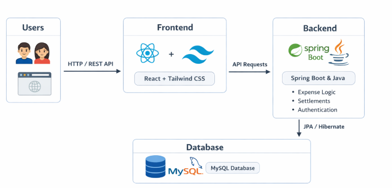

CRED Expense Management System

A full-stack web application to manage shared expenses, group-based bill splitting, settlements, and transaction history with a modern, intuitive user experience.

Project Overview

    CRED Expense is designed to simplify expense sharing among friends, teams, or groups:

    Users can create groups, add members, and record shared expenses.

    Expenses are automatically split and balances are calculated transparently.

    Users can settle dues and track full settlement history.

    The system ensures accuracy, clarity, and ease of financial collaboration.

    Focused on simplicity, transparency, and real-time financial tracking.

Key Highlights

    Group-Based Expense Management

    Create groups and manage members.

    Track expenses per group clearly.

    Smart Expense Splitting

    Automatically splits expenses among selected participants.

    Calculates who owes whom and how much.

    Balance Tracking & Settlements

    Real-time balance computation.

    One-click settlement of dues.

    Removes settled balances automatically.

    Settlement History

    Complete audit trail of all settlements.

    View payer, receiver, group, amount, and timestamp.

Notifications & UX

    Toast-based success and error notifications.

    Clean, modern UI for better user understanding.

Technology Stack

    Layer	Technology / Tool
    Frontend	React 19, Tailwind CSS, Axios, Framer Motion, React Toastify
    Backend	Spring Boot, Java, JPA / Hibernate
    Database	MySQL
    Authentication	Session-based authentication
    Build Tool	Maven

Features

User

    Register and login securely

    Create and manage groups

    Add expenses with selected participants

    View outstanding balances

    Settle dues with other users

    View complete settlement history

    Dashboard overview of financial activity

    Secure session handling

    Consistent transaction tracking

    Audit-ready settlement records

Project Structure

    cred-expense/
        ├── backend/
        │   ├── controller/
        │   ├── service/
        │   ├── service/impl/
        │   ├── repository/
        │   ├── model/
        │   └── application.properties
        ├── frontend/
        │   ├── components/
        │   ├── pages/
        │   ├── layouts/
        │   ├── utils/
        │   └── main.jsx
        ├── README.md

Setup Instructions

Backend (Spring Boot)
    cd backend
    mvn clean install
    mvn spring-boot:run

Configure database credentials in:

src/main/resources/application.properties

Frontend (React + Vite)
    cd frontend
    npm install
    npm run dev

Access

Open the application in your browser:

http://localhost:5173

Backend runs by default on:

http://localhost:8080

Application Workflow

    User registers and logs in

    Creates groups and adds members

    Adds expenses with participants

    System calculates balances automatically

    Users settle dues

    Settlement history is recorded permanently

